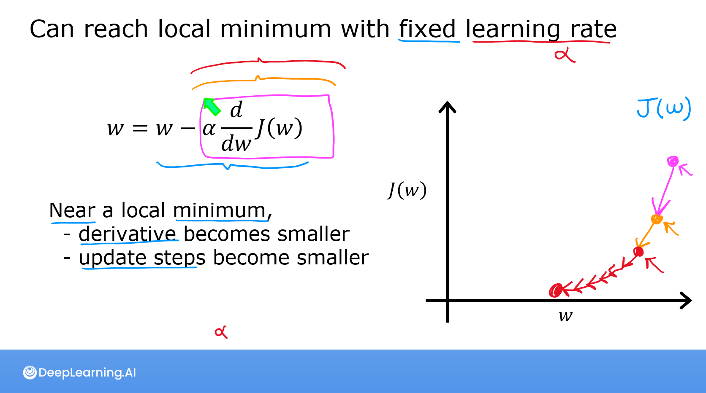

# C1: Supervised Machine Learning

- Triển khai vectorization nhanh hơn loop thông thường (parallel process)

- f(w, b) = wx + b

- Cost Function: J(w, b) = (1/2m) * Σ(yi - ŷi)² với i = 0 -> m - 1
  - (yi - ŷi) là hiệu số giữa giá trị thực tế và giá trị dữ đoán
  - Sử dụng bình phương sai số để đảm bảo các giá trị âm và dương không bị loại bỏ, đồng thời tăng ảnh hưởng của các sai số lớn của mô hình => giảm thiểu sai lệch
  - 1/2m để thuận tiện trong các tính toán đạo hàm

- Gradient Descent:
  - Mục tiêu của Gradient Descent là tìm w và b sao cho J(w, b) min -> tìm hướng để J(w, b) giảm nhanh nhất -> tìm đạo hàm của J(w, b) theo w và b -> tìm đạo hàm riêng của J(w, b)
  - Đạo hàm theo w: ∂J/∂w = (1/m) * Σ(xi * (yi - ŷi)) với i = 0 -> m - 1
  - Đạo hàm theo b: ∂J/∂b = (1/m) * Σ(yi - ŷi) với i = 0 -> m - 1

  
  
  
- Cost đa biến

- Feature Scaling
  - Min-max scaling: xi_normalized = (xi - min(x)) / (max(x) - min(x))
  - mean normalization: xi = (xi-mean(x))/(max-min)
  - z-score normalization
    xi_standardized  = (xi-mean(x))/std(x)
    xi_standardized là giá trị chuẩn hóa của đặc trưng xi.
    mean(x) là trung bình của tất cả các giá trị của đặc trưng x.
    std(x) là độ lệch chuẩn của tất cả các giá trị của đặc trưng x.
  

- Feature engineering, Polynomial Regression
- Scikit-learn intro

- Sigmoid function: sigmoid(z) = 1 / (1 + exp(-z))
- Logistic Regression: f_wb(x) = sigmoid(w dot x + b)
  - Không dùng được sai số bình phương do f_wb(x) phi tuyến tính
  - Loss function
    
    

- Regularized Cost Gradient
  
  
  

# C2: Advanced Machine Learning

- Neural:
  - Activation function
  - Layers
  - Neuron

- Neuron without activation function: f(x) = w dot x + b (linear regression)
  - linear_layer = tf.keras.layers.Dense(units=1, activation = 'linear', )
- Neuron with sigmoid activation function: f(x) = sigmoid(w dot x + b) (logistic regression)

- Normalize Data (chuẩn hóa dữ liệu): chuẩn hóa dữ liệu về phân phối chuẩn

- ReLU (Rectified Linear Unit) activation function được sử dụng phổ biến nhất: a = max(a, z)

  - ReLU tính toán nhanh hơn sigmoid, việc thực hiện gradient descent nhanh hơn
  - 

Không sử dụng linear activation function trong hidden layer vì nó không có tính phi tuyến, dù có nhiều hidden layer thì
tổng thể vẫn là tuyến tính.

- Softmax activation function (dạng tổng quát của logistic regression):
  - 
  - Softmax thường được sử dụng trong mạng neural khi ta cần dự đoán xác suất xảy ra của các lớp trong bài toán phân loại đa lớp. Trong bài toán nhận dạng chữ số viết tay từ 0 đến 9, mạng neural sẽ cho ra một vector đầu ra, sau đó áp dụng hàm Softmax để chuyển đổi các giá trị này thành xác suất của mỗi số từ 0 đến 9. Lớp với xác suất cao nhất sẽ được chọn là kết quả dự đoán của mô hình.

- Lựa chọn activation function? Tùy thuộc vào nhãn dữ liệu đầu ra.
  
  Ví dụ như nếu nhãn dữ liệu đầu ra là nhị phân thì sử dụng sigmoid function, ví dụ nếu dự đoán tăng, giảm giá (âm và
  dương) thì sử dụng linear activation function. Nếu y không âm (ví dụ giá cả) thì ReLU

- Cross-entropy loss đo lường sự khác biệt giữa phân phối xác suất dự đoán của mô hình và phân phối xác suất thực tế của các lớp trong bài toán.
  
  - k là số lượng lớp (số lượng đầu ra của mô hình).
  - y_i là nhãn thực tế của lớp thứ i, là một giá trị nhị phân (0 hoặc 1) biểu thị lớp thứ $i$ có phải là lớp đúng hay không.
  - pi là xác suất dự đoán của mô hình cho lớp thứ i.
  - Nếu xác suất dự đoán của mô hình gần với nhãn thực tế thì lỗi sẽ gần với 0, còn nếu xác suất dự đoán xa khỏi nhãn thực tế thì lỗi sẽ tăng lên vô cùng. Mục tiêu của quá trình huấn luyện mô hình là tối thiểu hóa giá trị cross-entropy loss để tăng hiệu suất của mô hình trong việc dự đoán phân loại.

- Evaluating a model:
  - 
  - 

- Độ lệch và Phương sai (Bias and Variance)
  
  - Plot train, cross validation, test
  - finding the optimal degree
  - Tuning Regularization
- Adam algo (Adaptive Moment Estimation)

30, 31 (optional)

- Debugging a learning algorithm
  - thêm dữ liệu vào train (fixes high variance)
  - bớt feature (fixes high variance)
  - thêm feature (fixes high bias)
  - thêm polynomial feature (fixes high bias)
  - giảm alpha (fixes high bias)
  - tăng alpha (fixes high variance)

- *(vấn đề: phát hiện bias, variance?)

- regularization param ảnh hướng đến bias và variance

- reduce bias/variance. tradeoff

Adding Data

- data augmentation

Transfer learning

MLOps

False Positives and False Negatives

Trading off precision and recall
F1-score:
harmonic mean:  F1score = 1/[1/2(1/P + 1/R)] = 2PR/(P+R)

- Decision Trees

- One Hot Encoded dataset: chuyển các đặc trưng không liên tục (categories variables) thành binary variables. k value -> k binary features

- Random Forest algo
  - Random Sampling with Replacement (bootstrapping)
  - Random Feature Selection

# C3: Unsupervised Learning, Recommenders, Reinforcement Learning

-Unsupervised learning
- Clustering: nhóm các dữ liệu liên quan đến nhau
  - Anomaly detection
- Recommender Systems
- Reinforcement Learning

- k-mean algo
  - cost function: J(c, mu) = 1/m * sum(||x(i) - mu(c(i))||^2) - distortion
  - random init
  - find k -> elbow method???
  - *find k for later purpose
  - Nén ảnh

- Anomaly Detection
  - Gaussian Distribution
    
  - multivariate gaussian distribution
  - *find epsilon for later purpose

- Recommendation system
  mean normalization
  collaborative filtering
  content-based filtering

- Principle Component Analysis (PCA algo)

